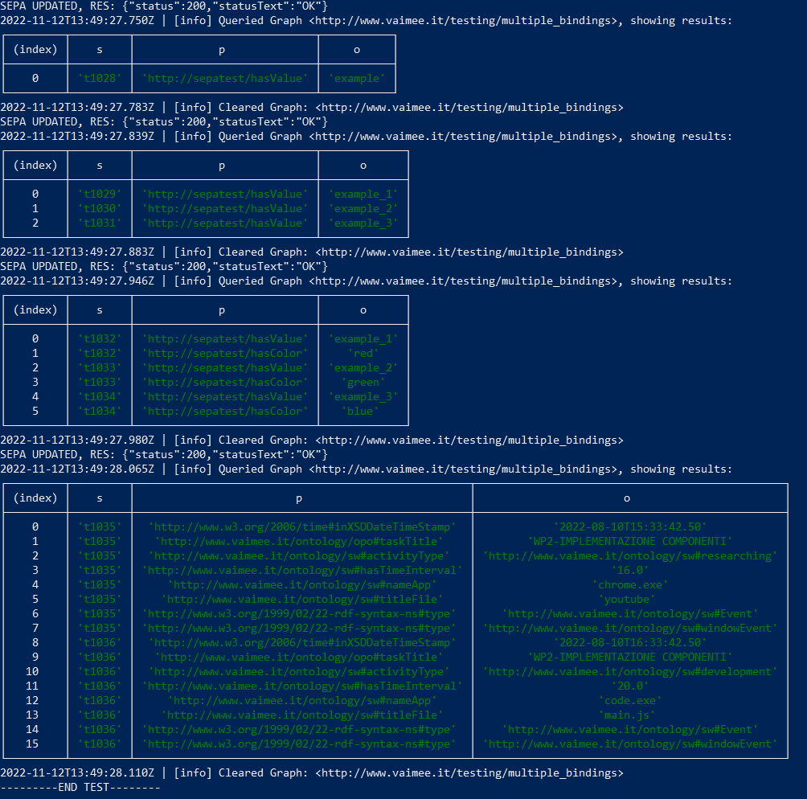

# SEPA-JS: MultipleForcedBindings DEMO
## Introduction
This repository is intended to show off the new features of the extended SEPA-JS querybench api.
Specifically, this extension allows to use Multiple Forced Bindings not only in sparql queries (with the VALUES keyword), but also in sparql 1.1 updates.

## Usage
All the modifications are restricted to the querybench.js file, so using this new version of the api should feel exactly the same as before.
Simply define your Forced Bindings in one of the following ways:
### single bindings
<pre>
const data={
  s: "http://sepatest/examplesubject",
  p: "http://sepatest/hasPredicate",
  o: "example"
}
</pre>
### multiple bindings
<pre>
const data={
  s: ["http://sepatest/examplesubject_1","http://sepatest/examplesubject_2"],
  p: ["http://sepatest/hasPredicate_1","http://sepatest/hasPredicate_2"],
  o: ["example","example_2"]
}
</pre>
### mixed bindings
<pre>
const data={
  s: ["http://sepatest/examplesubject_1","http://sepatest/examplesubject_2"],
  p: "http://sepatest/hasPredicate",
  o: ["example","example_2"]
}
</pre>

then run your query and see the results!
The only constraint is that the Array Bindings MUST have the same size.

## HOW TO RUN THIS DEMO
To run the test, simply clone this repository, open your terminal and cd into the root directory, then run the following command:
<pre>node runPacApp testClient</pre>
After running the command, the application will run four different queries (single bindings, multiple bindings, mixed bindings and a My2sec example query) and diplay query results in tabular form. 
You should see someting similar to this on your terminal:
 

